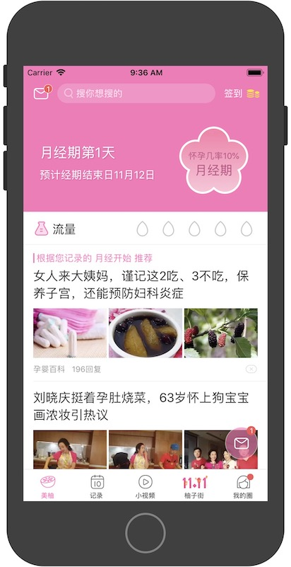
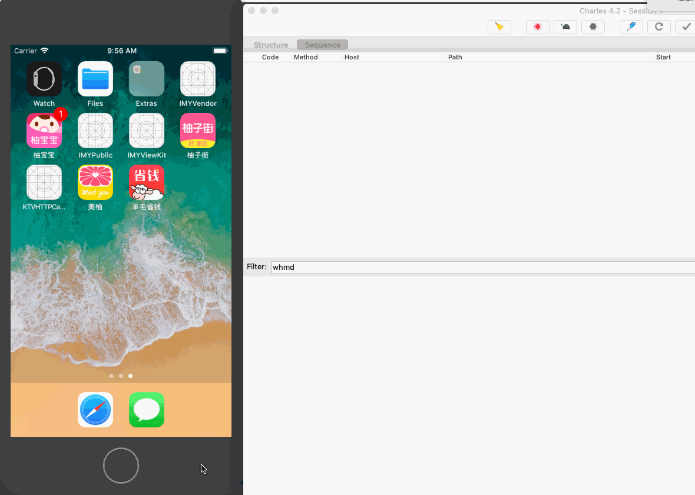

# <center>  手动埋点与无痕埋点的差别

## 首先看下我们的首页

首先是用户看到的样子，如下图



但是在系统中，真正显示和绘制出来样子并不是如此


首页由于首页顶部有个置顶header，所以整个 feeds 流控件会下移，但是 feeds流控件并不会被裁剪，只是整个被下移了，所以在系统中还是渲染出来的。

而左右两个feeds流是为了 提升 用户体验，我们会预加载左右两个子tab，但是对系统来说，它是不管可视区域的，只要加载到Window中都会渲染出来

## 手动埋点

现在来说手动埋点，手动埋点都是基于 系统回调，比如 iOS 的 `willDisplay..` Android 的 `getItem..` 等

但是这些回调，都是基于 `各自的父控件（feeds）` 来判断的，并不会管 是否在显示窗口内， 所以下图中的控件都会走曝光回调


一开始的手动埋点中，就有 `较多的多上报 或者 少上报` 的问题， 因为要在手动埋点中去判断自己是否显示的相关逻辑超级复杂

`为啥复杂？` 当系统回调的时候判断下 是否在显示窗口 范围内不就好了？这牵扯出另一个问题

```
系统的 `willDisplay` 的相关回调只会执行一次，比如当feeds流往上拖了，你的控件真的显示了， 但是系统不会再给你回调了，
因为对它来说，它已经回调一次了，这个控件一直是属于 可见状态

这还是没考虑 广告覆盖，小视频覆盖，时长相关的埋点情况...
```

这是 iOS `部分` 曝光埋点的相关代码，为了保证上报的准确性，我们前后持续迭代了 1年多，N个版本后的代码，才保证了 `无bug`，Android 还在小bug中徘徊

```
#pragma mark - 统计上报
- (void)willDisplayReportWithCell:(UITableViewCell *)cell forItemAtIndexPath:(NSIndexPath *)indexPath {
    /// 如果VC 没在显示状态下，则不曝光
    if (!self.isViewActived) {
        if (!_hasKVOActived) {
            _hasKVOActived = YES;
            @weakify(self);
            [[[[RACObserve(self, isViewActived) skip:1] filter:^BOOL(id value) {
                return [value boolValue];
            }] take:1] subscribeNext:^(id x) {
                @strongify(self);
                /// 补曝光
                [self displayReportWithCell:nil atIndexPath:nil];
            }];
        }
    } else {
        /// 正常曝光逻辑
        [self displayReportWithCell:cell atIndexPath:indexPath];
    }
}

- (void)displayReportWithCell:(UITableViewCell *)cell atIndexPath:(NSIndexPath *)indexPath {
    if (_hasExposured) {
        [self displayReportAction:indexPath onCell:cell];
    } else {
        NSString *queueKey = [NSString stringWithFormat:@"NewsTabExposured_%p", self];
        if ([NSObject imy_hasAsyncBlockForKey:queueKey]) {
            return;
        }
        @weakify(self);
        [NSObject imy_asyncBlock:^{
            @strongify(self);
            [self flushPendingExposureCells];
        }
                         onLevel:IMYQueueLevelMain
                     afterSecond:2
                          forKey:queueKey];
    }
}

/// 补上报显示范围内的 cells
- (void)flushPendingExposureCells {
    _hasExposured = YES;
    @weakify(self);
    imy_asyncMainBlock(^{
        @strongify(self);
        for (UITableViewCell *cell in self.tableView.visibleCells) {
            [self displayReportAction:nil onCell:cell];
        }
    });
}

- (void)displayReportAction:(NSIndexPath *)indexPath onCell:(UITableViewCell *)cell {
    if (!cell && indexPath) {
        cell = [self.tableView cellForRowAtIndexPath:indexPath];
    }
    if (!indexPath && cell) {
        indexPath = [self.tableView indexPathForCell:cell];
    }

    IMYRecommendBaseModel *model = [self cellModel:indexPath];
    if (!indexPath || !model || !cell) {
        return;
    }
    if (model.recomm_type == IMYRecommendTypeReadPosition) {
        return;
    }
    if (model.isReport) {
        return;
    }
    if (!cell.imy_inFeedsVisible) {
        ///cell 不在 feeds 显示窗口内
        return;
    }

    model.isReport = YES;
    [self displayReportAction:indexPath onModel:model];
}

- (void)displayReportAction:(NSIndexPath *)indexPath onModel:(IMYRecommendBaseModel *)model {
    NSString *redirect_url = model.redirect_url;
    //预加载数据
    [[IMYNewsPrefetcher shareInstance] prefetchNews:redirect_url];

    if (model.recomm_type == IMYRecommendTypeCardPregnancy) {
        //        model.recommendId == 4 今日密报
        [IMYEventHelper event:model.recommendId == 4 ? @"home-jrmbcx" : @"home-hyjlcx"];
    } else if (model.recomm_type == IMYRecommendTypeCardEage) {
        [IMYEventHelper event:@"home-xzkpcx"];
    } else if (model.recomm_type == IMYRecommendTypeCardSubject) {
        [IMYEventHelper event:@"home-ztcx"];
        IMYRecommendCardModel *cardModel = (IMYRecommendCardModel *)model;
        if (cardModel.attr_type == IMYNewsCardSubjectType_BigPic || cardModel.attr_type == IMYNewsCardSubjectType_NoPic || cardModel.attr_type == IMYNewsCardSubjectType_ThreePic) {
            if (cardModel.vote.items.count > 1) {
                [IMYEventHelper event:@"zttpcx"];
            }
        }
    } else if (model.recomm_type == IMYRecommendTypeActivity) {
        [IMYEventHelper event:@"h5hdbg" attributes:@{@"来源": self.title ?: @"推荐"}];
    } else if (model.recomm_type == IMYRecommendTypeUserRecommend) {
        [IMYEventHelper event:@"mrtjkpcx"];
    } else if (model.recomm_type == IMYRecommendTypeCardNewEage) {
        [IMYEventHelper event:@"home-nlkpcx"];
    } else if (model.recomm_type == IMYRecommendTypeInterestTagsCard) {
        [IMYEventHelper event:@"xqkpcx"];
    } else if (model.recomm_type == IMYRecommendTypeShortVideoCard) {
        [IMYEventHelper event:@"xspkpcx"];
    }

    //统计上报
    if (indexPath.section < 10) {
        [IMYEventHelper event:[NSString stringWithFormat:@"home-%@", @(indexPath.section + 1)]];
    }

    if ([model isKindOfClass:IMYRecommendNewsModel.class]) {
        IMYRecommendNewsModel *newsModel = (IMYRecommendNewsModel *)model;
        [IMYEventHelper event:@"home-zxtcx" attributes:@{@"来源": self.title}];
        if (newsModel.news_type == IMYNewsTypeVideo) {
            [IMYEventHelper event:@"home-spcx" attributes:@{@"来源": self.title}];
        }
        if (newsModel.attr_type == 1) {
            [IMYEventHelper event:@"home-cxmyh" attributes:@{@"来源": self.title}];
        }
        if (newsModel.top_comment) {
            [IMYEventHelper event:@"zxrpcx" attributes:@{@"来源": self.title}];
        }
    } else if (model.recomm_type == IMYRecommendTypeBook) {
        //小说曝光
        IMYNovelCardModel *novelModel = (IMYNovelCardModel *)model;
        if ([novelModel isKindOfClass:IMYNovelCardModel.class] && novelModel.recomm_type == IMYRecommendTypeBook) {
            if (novelModel.attr_type == 1) { //推荐
                IMYNovelModel *novel = novelModel.items.firstObject;
                if (imy_isNotEmptyString(novel.redirect_url)) {
                    redirect_url = novel.redirect_url;
                }
            } else if (novelModel.attr_type == 2) { //引流
                ;
            }
        }
    } else if (model.recomm_type == IMYRecommendTypeTrendingTopic) {
        if ([model isKindOfClass:IMYRecommendTrendingSubjectModel.class]) {
            //热议话题曝光
            IMYRecommendTrendingSubjectModel *subjectModel = (IMYRecommendTrendingSubjectModel *)model;
            NSMutableDictionary *params = [[NSMutableDictionary alloc] init];
            params[@"entrance"] = @(self.videoFeeds ? 3 : 1);
            params[@"floor"] = @(indexPath.section + 1);
            params[@"action"] = @(1);
            if (subjectModel.bi_uri) {
                params[@"redirect_url"] = subjectModel.bi_uri;
            }
            [IMYGAEventHelper postWithPath:@"bi_information" params:params headers:nil completed:nil];
        }
        [IMYEventHelper event:@"ryhtkpcx" attributes:@{@"来源": @"首页"}];
    } else {
        if (model.recomm_type == IMYRecommendTypeCard0) {
            [IMYEventHelper event:@"home-yjfxcx"];
        } else {
            [IMYEventHelper event:@"home-htcx" attributes:@{@"来源": self.title}];
        }
    }

    if ([model isKindOfClass:[IMYRecommendShortVideoModel class]]) {
        IMYRecommendShortVideoModel *newModel = (IMYRecommendShortVideoModel *)model;
        NSMutableDictionary *params = [NSMutableDictionary new];
        params[@"action"] = @(1);
        params[@"floor"] = @(indexPath.section + 1);
        params[@"entrance"] = @(1);
        params[@"card_type"] = @(model.card_type);
        NSDictionary *dic = @{ @"catid": @(self.newsCategoryId),
                               @"redirect-type": @(53),
        };
        IMYURI *uri = [IMYURI uriWithURIString:newModel.redirect_url];
        params[@"redirect_url"] = [NSString stringWithFormat:@"meiyou:///videocard?params=%@", [[dic imy_jsonString] imy_base64EncodedSafeURLString]];
        [IMYGAEventHelper postWithPath:@"bi_information" params:params headers:nil completed:nil];
        IMYNewsRootShortVideoCell *shortCell = [self.tableView cellForRowAtIndexPath:indexPath];
        [shortCell postBIInformationwithCardId:@(self.newsCategoryId) floor:indexPath.section + 1];
    }
    if (model.recomm_type == IMYRecommendTypeInterestTagsCard && [model isKindOfClass:[IMYRecommendInterestTagsModel class]]) {
        IMYRecommendInterestTagsModel *tagModel = (IMYRecommendInterestTagsModel *)model;
        NSMutableDictionary *params = [[NSMutableDictionary alloc] init];
        params[@"entrance"] = @(self.videoFeeds ? 3 : 1);
        params[@"floor"] = @(indexPath.section + 1);
        params[@"action"] = @(1);
        params[@"card_type"] = @(tagModel.card_type);
        params[@"redirect_type"] = @62;
        params[@"InterestKeyWords"] = [[tagModel.items valueForKey:@"tagId"] componentsJoinedByString:@","];
        [IMYGAEventHelper postWithPath:@"bi_information" params:params headers:nil completed:nil];
    } else if (model.recomm_type == IMYRecommendTypeUserRecommend) {
        //  今日关注推荐-曝光
        IMYNewsUserRecommendModel *recommendModel = (IMYNewsUserRecommendModel *)model;
        [self GAEventForInformationWithURL:recommendModel.bi_redirect_url.expose
                                     floor:indexPath.section + 1
                                    action:3
                                    params:@{ @"entrance": @(self.videoFeeds ? 3 : 1) }];

        [recommendModel.user_info enumerateObjectsUsingBlock:^(IMYNewsRootUserModel *obj, NSUInteger idx, BOOL *_Nonnull stop) {
            [self GAEventForInformationWithURL:obj.bi_redirect_url.click_avatar
                                         floor:idx + 1
                                        action:1
                                        params:@{ @"entrance": @(self.videoFeeds ? 3 : 1) }];
        }];
    }

    //BI 上报
    if (redirect_url.length > 0) {
        NSMutableDictionary *params = [[NSMutableDictionary alloc] init];
        params[@"action"] = @(1);
        if ([model isKindOfClass:IMYRecommendCardItemModel.class]) {
            params[@"floor"] = @(indexPath.row + 1);
        } else {
            params[@"floor"] = @(indexPath.section + 1);
        }
        params[@"entrance"] = @(self.videoFeeds ? 3 : 1);
        params[@"redirect_url"] = redirect_url;

        [IMYGAEventHelper postWithPath:@"bi_information" params:params headers:nil completed:nil];

        if ([model isKindOfClass:IMYRecommendCardItemModel.class]) {
            //专题虚拟曝光
            IMYRecommendCardModel *cardModel = [self.dataSource objectAtIndex:indexPath.section];
            if ([cardModel isKindOfClass:IMYRecommendCardModel.class] && cardModel.recomm_type == IMYRecommendTypeCardSubject) {
                if (cardModel.isReport == NO) {
                    params = [NSMutableDictionary new];
                    params[@"action"] = @(3);
                    params[@"floor"] = @(indexPath.section + 1);
                    params[@"entrance"] = @(self.videoFeeds ? 3 : 1);
                    params[@"redirect_url"] = cardModel.redirect_url;
                    [IMYGAEventHelper postWithPath:@"bi_information" params:params headers:nil completed:nil];
                    cardModel.isReport = TRUE;
                }
            }
        } else if ([model isKindOfClass:IMYNovelCardModel.class]) {
            //小说曝光
            IMYNovelCardModel *novelModel = (IMYNovelCardModel *)model;
            if ([novelModel isKindOfClass:IMYNovelCardModel.class] && novelModel.recomm_type == IMYRecommendTypeBook && novelModel.attr_type == 2) {
                params = [NSMutableDictionary new];
                params[@"action"] = @(3);
                params[@"floor"] = @(indexPath.section + 1);
                params[@"entrance"] = @(self.videoFeeds ? 3 : 1);
                params[@"redirect_url"] = novelModel.redirect_url;
                [IMYGAEventHelper postWithPath:@"bi_information" params:params headers:nil completed:nil];
                [novelModel.items enumerateObjectsUsingBlock:^(IMYNovelModel *obj, NSUInteger idx, BOOL *_Nonnull stop) {
                    NSMutableDictionary *params = [[NSMutableDictionary alloc] init];
                    params = [NSMutableDictionary new];
                    params[@"action"] = @(1);
                    params[@"floor"] = @(idx + 1);
                    params[@"entrance"] = @(self.videoFeeds ? 3 : 1);
                    params[@"redirect_url"] = obj.redirect_url;
                    [IMYGAEventHelper postWithPath:@"bi_information" params:params headers:nil completed:nil];
                }];
            }
        } else if ([model isKindOfClass:[IMYRecommendNewsModel class]]) {
            //热评曝光
            IMYRecommendNewsModel *newModel = (IMYRecommendNewsModel *)model;
            if (newModel.top_comment) {
                params = [NSMutableDictionary new];
                params[@"action"] = @(1);
                params[@"floor"] = @(indexPath.section + 1);
                params[@"entrance"] = @(self.videoFeeds ? 3 : 1);
                if (!newModel.top_comment.redirect_url) {
                    IMYURI *uri = [IMYURI uriWithURIString:newModel.redirect_url];
                    [uri appendingParams:@{ @"catid": @(self.newsCategoryId),
                                            @"news_type": @(newModel.news_type),
                                            @"review_Id": @(newModel.top_comment.review_id),
                                            @"redirect-type": @(55),
                                            @"newsId": @(newModel.recommendId) }];
                    newModel.top_comment.redirect_url = uri.uri;
                }
                params[@"redirect_url"] = newModel.top_comment.redirect_url;
                [IMYGAEventHelper postWithPath:@"bi_information" params:params headers:nil completed:nil];
            }
        } else if (model.recomm_type == IMYRecommendTypeTTQCard && [model isKindOfClass:[IMYRecommendTTQCardModel class]]) {
            //      圈子推荐卡片-曝光
            IMYRecommendTTQCardModel *cardModel = (IMYRecommendTTQCardModel *)model;
            [self GAEventForInformationWithURL:cardModel.redirect_url
                                         floor:indexPath.section + 1
                                        action:3
                                        params:@{ @"entrance": @(self.videoFeeds ? 3 : 1) }];

            [cardModel.items enumerateObjectsUsingBlock:^(IMYRecommendTTQCardItemModel *obj, NSUInteger idx, BOOL *_Nonnull stop) {
                [self GAEventForInformationWithURL:obj.redirect_url
                                             floor:idx + 1
                                            action:1
                                            params:@{ @"entrance": @(self.videoFeeds ? 3 : 1) }];
            }];
        }
    }
}


```

## 无痕埋点

无痕埋点我们也研发了近1年，从一开始的非常理想化，到现在实用化，也走了挺多弯路的。 我们做了 可视化埋点、递归回溯取值、区域深度取值、一系列自动化判定的方法和套件，最后发现还是绕不开业务。 

`因为你没有业务id，取到的任何控件信息都无意义`

简单的放两张示意图吧




### 我们转变了核心思想，我们把天天出错的 曝光和点击 的逻辑给包了， 把简单的参数配置交给外层

